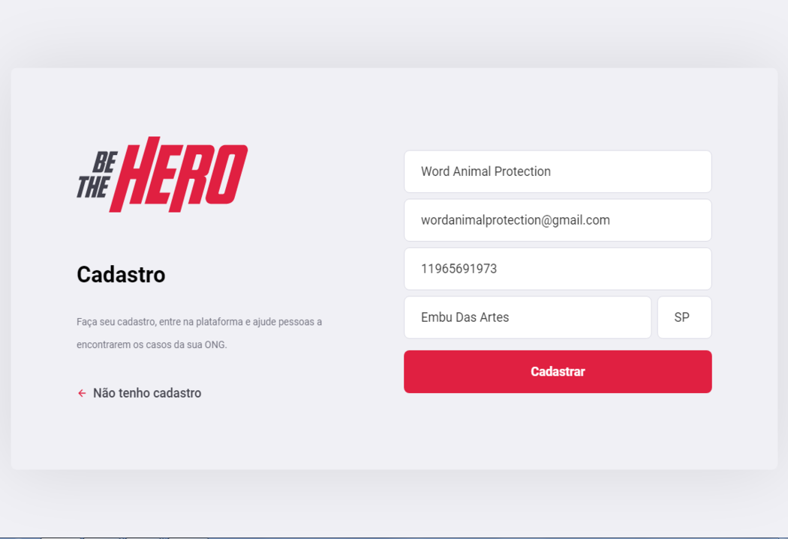
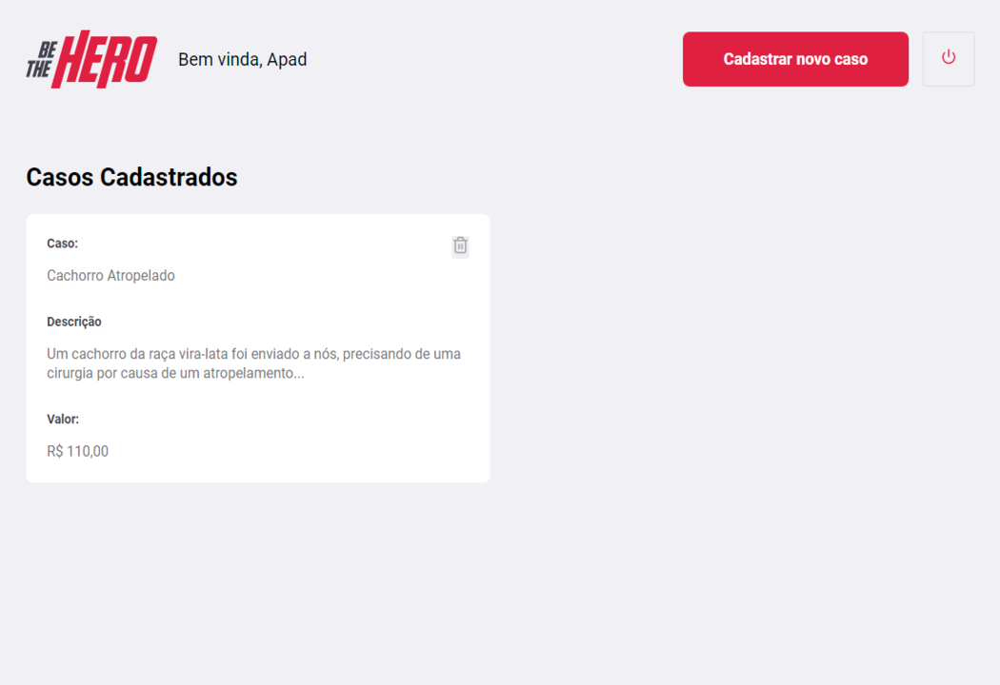
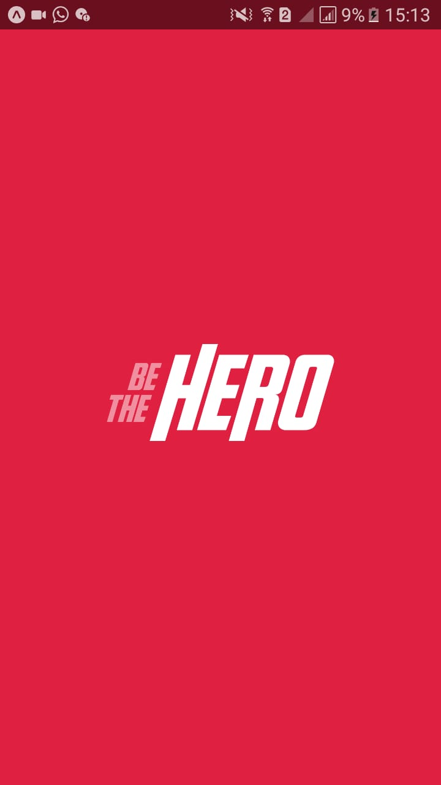
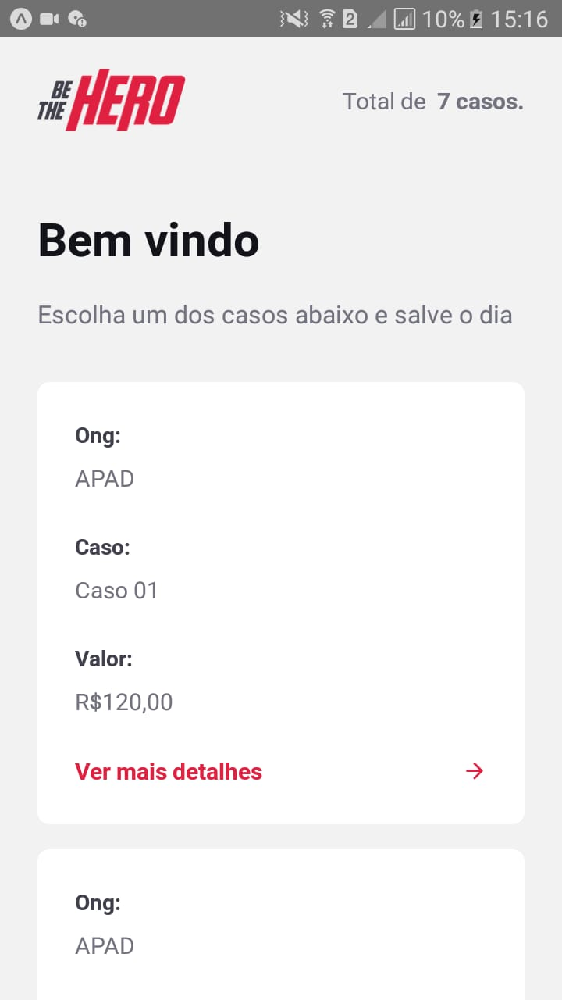
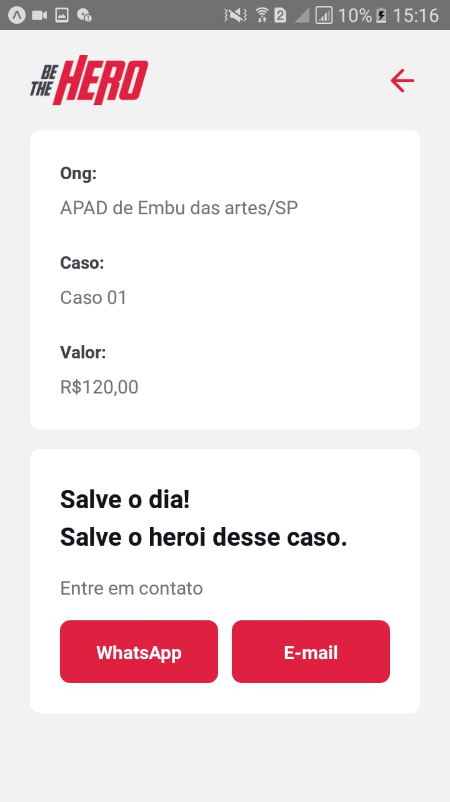

<h1 align="center">
    
</h1>

 
  O “Be The Hero” é um projeto que nos oferece a possibilidade de ser o herói de um animal,
  as ONGS podem se cadastrar pela nossa aplicação web, e registrar casos (descrevendo o caso de um
  animal e estimando o valor que precisa ser atingido para ajuda-lo, ex: um animal que foi atropelado e necessita de R$ 120,00 para sua cirurgia), as pessoas podem ver os casos registrados, e qual foi a ONG que realizou o cadastro do caso, podendo ajudar com uma doação, o app pode ser visto por dispositivos Android e IOS.

## Aplicação Web

### Landing 

    

### Registro de Ongs

    

### Home 

    

### Registro de Casos 

    

## Aplicação Mobile

<table>
  <tr>
    <th width="33.3%">
      Loading 
    </th>
    <th width="33.3%">
      Casos
    </th>
    <th width="33.3%">
      Detalhes do Caso
    </th>
  </tr>
  <tr>
    <td>
      
    </td>
    <td>
        
    </td>
    <td>
        
    </td>
  </tr>
</table>

## Funcionalidades

* Criar Usuários;

* Listar Casos;

* Criar Casos.

## Para rodar a aplicação

  * A primeira coisa é executar o comando yarn ou npm install,
  para instalar todas as dependencias necessárias para rodar o
  servidor, execute esse comando nas pastas Web, Mobile e Server.

  * Após a execução do comando yarn ou npm install efetue yarn start
  ou npm start na ordem de Servidor/Web ou Mobile, pois O lado do cliente
  (Web/Mobile) dependem do servidor.

  * Exclusivamente na parte da aplicação mobile é preciso instalar o Expo 
  no seu celular, quando você rodar a aplicação Mobile com o comando yarn
  start, o seu navegador irá abrir mostrando um QrCode, abra o Expo no seu
  celular, e clique na opção "Scan QR Code", aponte a câmera para o QrCode
  e aproveite para fazer testes no Proffy. 

  * É extremamente importante rodar o server antes da aplicação Mobile ou Web. 

## Tecnologias

  * NodeJS (Back-End);

  * ReactJS (Web Front-End);

  * React-Native (Mobile Front-End);

  * SQLite (Banco de Dados);

